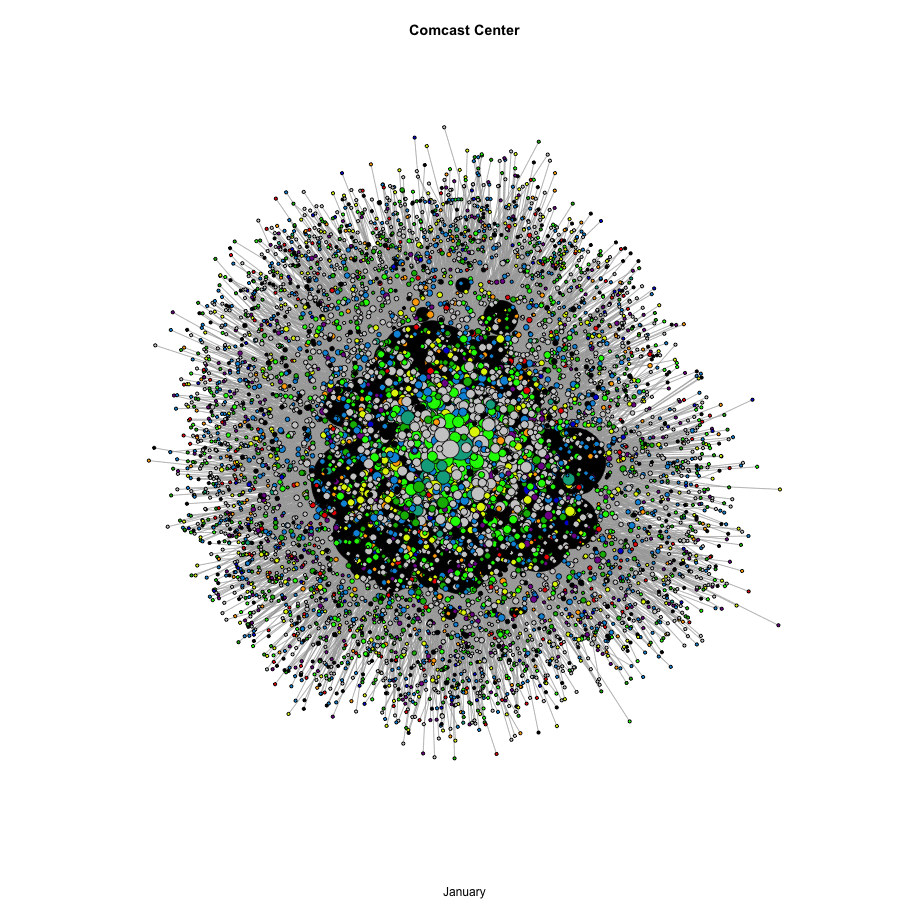
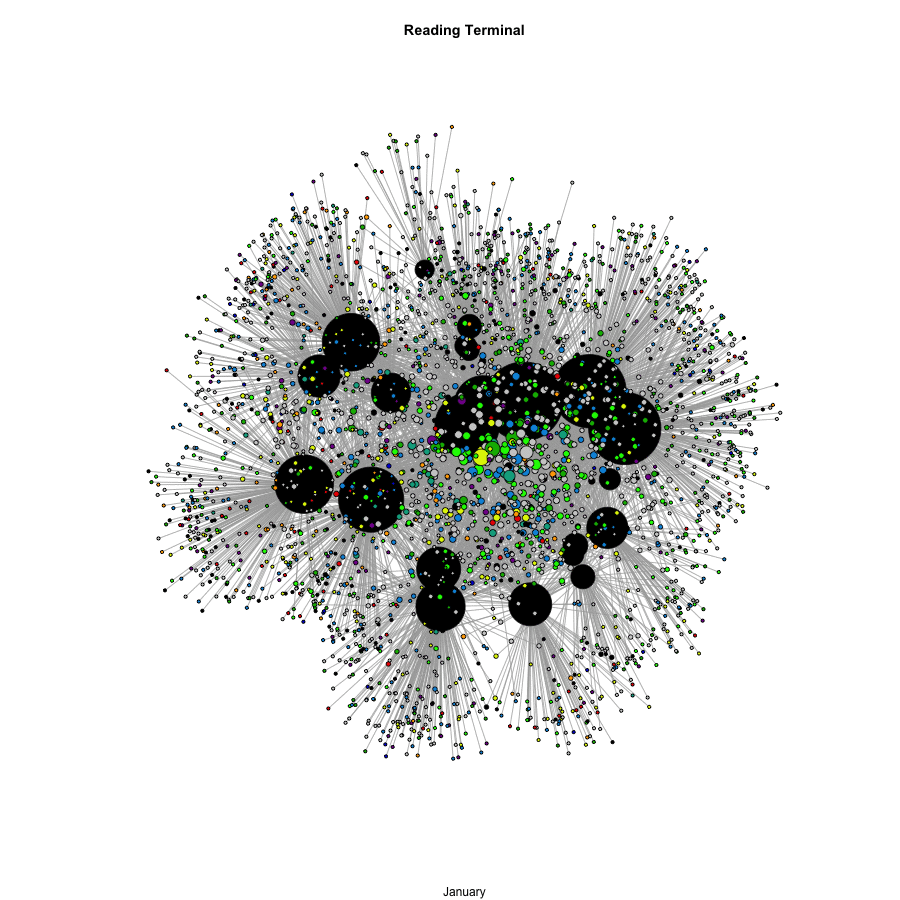

# networks
### network analysis in R

Here we use mobile phone logs to understand Philadelphia's socio-spatial network. The data come from a location data provider. Our edge list consists of neighborhoods and points of interest of the kind that you see on Google Maps—shops, restaurants, bars, museums and offices. Each neighborhood is a Census Block Group in Philadelphia. For a given connection, one column has a FIPS code, a second has a unique identifier for a point of interest, and a third column has the number of people that traveled from that Census Block Group to that venue. This final column can be used for weights in the network. We have this data for each month from January to August (and soon for September). There are 2.3 million connections between neighborhood and point interest—what some in transportation planning call “origin-destination pairs”—so far this year; each connection has one or more visits. The infographic below defines some of the terms that will follow below.  

**Neighborhood-Venue Flows, the complete network**

With 20,000 points of interest in Philadelphia and 1,300 Census Block Groups, the network is dense. This makes it hard to interpret the connections, so we can pull out certain venues or locales and construct *ego* networks around them, exploring how the network is changing over time. Here we use Reading Terminal Market and the Comcast Center, busy hubs of activity before the pandemic, as launching points. Neighborhoods are black and sized to their degree centrality, while businesses and other points of interested a colored by category and sized by degree.

This allows us to see the network become more and more sparse across time; the shift from March to April is marked for both of these parts of the city. With these twin case studies—one exploring the collapse of office work and the other tourism—we can see that Philadlephia is still struggling to recover from measures to contain the virus.

**Neighborhood-Neighborhood Interactions, shared points of interest**

The diagonal here conveys the total number of interactions that a given neighborhood has had with other neighborhoods, via a point of interest, since our dataset has two modes—one for neighborhoods and one for points of interest. We use matrix multiplication to reduce the edge list to an adjacency matrix wherein each value—each interaction between two neighborhoods—corresponds with the number of venues that residents of these two areas both visit. If people from South Philadelphia and West Philadelphia frequent a pub in Center City, perhaps because they send employees into the business district during the day those employees go attend a happy hour nearby after work, then *those two neighborhoods are linked*. We can think of this as co-presence: both communities share a second or third place (borrowing from Ray Oldenburg). This means that the diagonal is the total number of interactions from all neighborhoods in the graph, a summary of a neighborhood’s role in the network.  

**Venue-Venue Interactions, shared clientele**

Likewise, the diagonal here is the total number of interactions that one venue has with another venue, via the neighborhoods that it services. Again, if people from Rittenhouse Square frequent a restaurant and a grocer, *these two venues are linked by their shared clientele*. The sum of a venue’s interactions with other venues, via its clientele, is the diagonal. If we do not amend the diagonals, there will be loops on the graph, representing illusory connections between a node and itself.  

In both of these sociograms, there is initially a dense network of connections, suggesting that Philadelphia is integrated and connected: neighborhoods have many connections to other neighborhoods, who in turn have connections to other neighborhoods, and the same holds for locales when we adjust the focus of the graph from neighborhoods to points of interest. Yet when the pandemic reached its height in April and May, the web of connections thinned out and clusters formed. Between January and April, the diameter of the graph—the shortest path between the most remote nodes—grew from 48 to 64. Philadelphia, then, was never a small world network, but it has only become more segregated as interactions between neighborhoods are less frequent. Even in July and August, we had still not recovered to the level of connection seen in January and February, despite those being winter months.

Here we use undirected graphs, because the adjacency matrix contains no information on the direction of these connections. Had we chosen to create directed graph, we would have doubled number of edges while holding the number of vertices constant. So in the neighborhood-neighborhood example, there are roughly 1300 vertices corresponding to the 1300 Census Block Groups in Philadelphia, with 225,000 unique connections between them when the graph is undirected and 450,000 when the graph is directed.        
